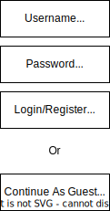
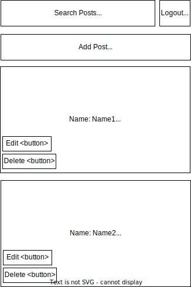

# Reddit Clone

## How to Run

We can run this app on localhost or Heroku. To change the port, go to [App.js](front-end/src/App.js) and see lines 19-20.

We can run this app with MongoDB Atlas (required for Heroku, works with localhost) or MongoDB Compass (only works with localhost). To change the mongo port, go to [app.mjs](back-end/app.mjs) and see lines 34-37.  

## Overview

Reddit Clone that allows users to register an account, login, and perform CRUD (create, read, update, delete) operations on posts.

## Data Model

The application will store Users and Posts. 
Users can have multiple Posts. 

An Example User:

```javascript
{
  username: "name",
  password: "password hash"
}
```

An Example Post:

```javascript
{
  name: "name",
  text: "text",
  createdAt: // timestamp
}
```


## [Link to Commented First Draft Schema](back-end/db.mjs) 


## Wireframes

Created with [draw.io](https://draw.io/)

/login - page login



/ - page for showing all posts



## Site map

Created with [draw.io](https://draw.io/)


## User Stories or Use Cases

1. as non-registered user, I can register a new account with the site
2. as a user, I can log in to the site
3. as a user, I can create, edit, and delete my own posts
4. as a user, I can view, search, and sort posts created by any user
5. as a guest, I can create, edit, and delete only guest posts
6. as an admin, I can create, edit, and delete posts created by any user

## Research Topics

Total of 10 points
* (2 points) ESLint
* (2 points) Bootstrap 
* (6 points) React 

Links below show that ESLint was installed
- [Link to front-end package.json](front-end\package.json)
- [Link to back-end package.json](back-end\package.json)

## [Link to Initial Main Project File](back-end/app.mjs) 

## Annotations / References Used

1. [App/Project setup](https://nyu-agile-development.github.io/course-materials/)
2. [MongoDB Setup](https://www.prisma.io/dataguide/mongodb/setting-up-a-local-mongodb-database)
3. [Express Export Default 1](https://bobbyhadz.com/blog/javascript-export-default-was-not-found#:~:text=The%20%22export%20default%20was%20not,of%20how%20the%20error%20occurs)
4. [Express Export Default 2](https://stackoverflow.com/questions/36261225/why-is-export-default-const-invalid)
5. [React Navigate](https://stackoverflow.com/questions/50644976/react-button-onclick-redirect-page)
6. [React Button Type](https://stackoverflow.com/questions/52834504/react-form-submission-canceled-because-the-form-is-not-connected)
7. [CORS Error](https://stackoverflow.com/questions/41497674/access-control-allow-origin-issue-when-api-call-made-from-react-isomorphic-ap)
8. POST 400 Bad Request - resolved in office hours. Mongoose schema had all required fields but those fields were not reflected on the front end form, so form submission did not go through. How to fix: chrome dev tools, network, click on the red request, click on preview or response on the right side.
9. [Mongoose Schema Example](https://kb.objectrocket.com/mongo-db/a-nodejs-mongoose-schema-example-1204)
10. [Mongoose Only ID And V Fields](https://stackoverflow.com/questions/56763188/mongoose-only-saves-id-and-v)
11. [Mongoose Form Match Mongo](https://stackoverflow.com/questions/57860425/how-to-fix-mongodb-documents-being-just-id-and-v)
12. [Navigate Pass Props](https://stackoverflow.com/questions/64566405/react-router-dom-v6-usenavigate-passing-value-to-another-component)
13. [Navigate From react-router-dom Vs react-navigation, Read Comment](https://stackoverflow.com/questions/70621070/how-do-i-pass-props-to-next-screen-using-navigate)
14. [Remove Object From Array Using Find](//https://stackoverflow.com/questions/10024866/remove-object-from-array-using-javascript)
15. [React Search Cuts String](https://stackoverflow.com/questions/57754546/why-filtering-state-array-with-react-hooks-doesnt-work-but-filtering-original-a#:~:text=This%20is%20because%20you%20save,filtering%20on%20teams%20is%20not.)
16. [React Search Copy Data](https://levelup.gitconnected.com/how-to-search-filter-through-data-in-react-26f1545fe3a1)
17. [React Show/Hide Buttons (Conditional Rendering)](https://stackoverflow.com/questions/71004124/how-to-hide-button-when-another-button-is-clicked-in-react)
18. [React Call 2 Functions OnClick](https://stackoverflow.com/questions/26069238/call-multiple-functions-onclick-reactjs)
19. [CSS Text Wrap](https://stackoverflow.com/questions/3587390/how-can-i-make-text-appear-on-next-line-instead-of-overflowing) 
20. [React Bootstrap](https://create-react-app.dev/docs/adding-bootstrap/)
21. [React Search 1 Input Behind](https://stackoverflow.com/questions/62034272/when-updating-the-state-of-the-search-input-it-is-always-1-input-behind-in-react)
22. [File.js vs File.mjs](https://stackoverflow.com/questions/57492546/what-is-the-difference-between-js-and-mjs-files)
23. ESLint couldn't find the plugin "eslint-plugin-mocha" - make sure to run "npm install eslint-plugin-mocha@latest --save-de" from the final project directory, DO NOT cd into front-end or back-end before running this command.
24. [React State With Props](https://stackoverflow.com/questions/54865764/react-usestate-does-not-reload-state-from-props)
25. [React Select Tag For Dropdown](https://reactjs.org/docs/forms.html#the-select-tag)
26. [CSS Hexcode](https://www.reddit.com/r/jailbreak/comments/bnup2h/help_can_someone_track_down_the_hex_color_code/)
27. [CSS Repeat Style Or Selector](https://stackoverflow.com/questions/9612278/which-is-faster-repeating-styles-or-repeating-selectors)
28. [CSS Span No New Line](https://stackoverflow.com/questions/7300760/prevent-line-break-of-span-element)
29. [Heroku Build Limit](https://stackoverflow.com/questions/47028871/heroku-your-account-has-reached-its-concurrent-build-limit)
30. [Heroku Front End Port 1](https://medium.com/@siobhanpmahoney/deploying-a-react-frontend-rails-backend-project-to-heroku-4b2c4f6f630c)
31. [Heroku Front End Port 2](https://stackoverflow.com/questions/66798415/how-to-access-the-environment-port-on-client-side-in-heroku)
32. [ES6 .env Files](https://www.npmjs.com/package/dotenv)
33. [Geo 1](https://medium.com/how-to-react/how-to-get-user-ip-address-in-react-js-73eb295720d0)
34. [Geo 2](https://stackoverflow.com/questions/49257729/retrieving-the-client-request-ip-address)
35. [Geo 3](https://stackoverflow.com/questions/391979/how-to-get-clients-ip-address-using-javascript)
36. [Cors API](https://enable-cors.org/server_expressjs.html)
37. [Eslint Front End React Not Working](https://stackoverflow.com/questions/59633005/how-is-eslint-integrated-into-create-react-app)
38. [Eslint React Front End Not Working](https://stackoverflow.com/questions/60289601/override-eslint-settings-in-non-ejected-create-react-app)

## Test Cases

- add post
- edit post (only under your name)
- delete post (only under your name)
- search posts
- sort posts
- search then sort posts
- sort then search posts
- sort then add posts 
- sort then delete posts
- register/login
- admin

## Interesting

Read into .then(user) vs callback params (err, user) vs await for different ways to get the result (called user) of an asynchronous mongo query in app.mjs.

## APIs

Do not use http links, only use https. Remember to add that link to cors on the back end. Tested all of the below links, all run into problems with AdBlock. None of these links are being used in the project.
- v4 below
1. [Link](https://geolocation-db.com/json/)
2. [Link](https://api.ipify.org?format=json)
3. [Link](https://api.db-ip.com/v2/free/self)
4. [Link](http://www.geoplugin.net/json.gp)
5. [Link](https://ipapi.co/json/)
6. [Link](http://ip-api.com/json)
7. [Link](https://api.ipify.org/?format=json)
8. [Link](https://ipinfo.io/json)
- v6 below
9. [Link](https://www.cloudflare.com/cdn-cgi/trace)
10. [Link](https://jsonip.com/)
11. [Link](http://ip.jsontest.com/)

## Heroku Hosting

[Hosted Here](https://dl4422.herokuapp.com/).

Make sure the link is https://dl4422.herokuapp.com/ and NOT https://dl4422.herokuapp.com/login.

The path https://dl4422.herokuapp.com/ automatically redirects to https://dl4422.herokuapp.com/login. 

DO NOT go directly to https://dl4422.herokuapp.com/login. Heroku is running the back end and "faking" the front end by serving a static file. Because of that, all of the Heroku front end routes are actually back end routes. Going directly to https://dl4422.herokuapp.com/login goes to back end "/login" route instead of going to the front end "/login" route. Read below to see how it works. Since we are deploying the front end and back end together on Heroku, we cannot make the distinction between the front end and back end routes. One potential fix is deploying the back end on Heroku and the front end on Netlify. Then we would have 2 routes, just like localhost's separate back end and front end.

### Heroku Version Control

In VSCode version control, this project may be connected to 2 repos. If that is the case, the second one is Heroku. If we newly clone this repo, this project will only be connected to 1 repo. To check repos, use the command: git remote -v.

### Heroku Tutorial

We will discuss Heroku setup and tutorials below. The lines of code below this point came from [this video](https://www.youtube.com/watch?v=HZuGVvRonu0). 

When looking at tutorials, make sure the tutorial is not outdated. Any tutorial that uses MongoLab sandbox IS OUTDATED. We use MongoDB Atlas now. 

When looking at tutorials, be careful of their project file structure. Many tutorials have a project folder that contains a front-end folder and the server files WITHIN the project folder. This project folder has a front-end folder AND a back-end folder. This will change many commands regarding file paths, because once we cd into back-end, we have to cd out (cd ..) before we can cd into front-end. Note that many of the online tutorials will directly cd front-end. DO NOT DO THIS.

### Heroku Serve Front End From Back End

Heroku renders the React front end with a static file in the following block of code. This is why the front end route on Heroku https://dl4422.herokuapp.com/ is actually the back end "/" route instead of the front end "/" route, because the back end route serves the static front end file. 

There are 2 lines of code that are different because of the project file structure. Note the extra ".." in the app.use and res.sendFile statements in back-end/app.mjs:

```
if (process.env.NODE_ENV === 'production') {
  app.use(express.static('../front-end/build'));
  app.get('/', (req, res) => {
    res.sendFile(path.resolve(__dirname, '..', 'front-end', 'build', 'index.html'));
  })
}
```

This project used the app.get('/') for something else previously (fetching data from mongo). However, Heroku needs to use this path, so we need to change our previous app.get('/') path to something else, like app.get('/heroku'). Make sure to reflect this change on the front end with axios.get('server+/heroku'). The online tutorials directly override their old app.get('/') path because they DID NOT use their app.get('/') route, or it simply rendered text so it could be replaced with no problem.

Note that some tutorials use app.get('*') instead of app.get('/') in the code block above. This is very dangerous because it will override other app.get paths that are in use. They can do that because they don't use any other back end routes, but we do.

Thus, for this project, DO NOT USE app.get('*').

The build folder inside project/front-end only exists because of Heroku. If we are not using Heroku, we do not need the build folder. It appears to be a copy of the public folder that Heroku uses to serve the front end.

### Heroku Commands (package.json) 

Heroku works by running the commands in package.json to install and start up node. Make sure we are putting the commands in the project directory's package.json! DO NOT use project/back-end package.json or project/front-end package.json

We DO NOT need the extra ".." in the below lines in package.json. This is because heroku-postbuild starts from the project directory (root) and DOES NOT continue from the directory that "npm start" left off in (which is back-end).

```
"start": "cd back-end && npm install && node app.mjs",
"heroku-postbuild": "cd front-end && npm install && npm run build",
```

### Heroku MongoDB 

Heroku hosting requires MongoDB Atlas. We cannot use MongoDB Compass, it is localhost only. In MongoDB Atlas, click database on the left, then click connect on a cluster and select "Connect your application" and the password (SCRAM) option. Then click database access on the left, and edit a user to access their password by changing their password. MAKE SURE TO CLICK SAVE. Then use this mongo string for connection.

We can set the mongo port on the Heroku website. Click the project, then click settings on the top bar. Scroll down and click "Reveal Config Vars" to input the value. The key name is "MONGO_URI" and the value is the connection string.

### Heroku Back End Port

Heroku hosting requires a custom back-end port. 4000 is so common that is most definitely taken, so let Heroku generate the port number by using process.env.PORT in back-end/app.mjs. We don't need to set this in the config vars of the Heroku website because Heroku automatically generates this (unlike the mongo port). 

### Heroku Front End Port

Heroku hosting also requires a different front-end port. We cannot use localhost:4000 as the server route in the front-end. We have to replace it with the route of the Heroku app (https://dl4422.herokuapp.com/). 

The following sources confirm this:
- [Reference #30](https://medium.com/@siobhanpmahoney/deploying-a-react-frontend-rails-backend-project-to-heroku-4b2c4f6f630c)
- [Reference #31](https://stackoverflow.com/questions/66798415/how-to-access-the-environment-port-on-client-side-in-heroku)
